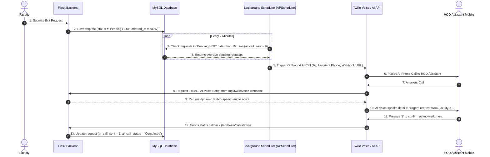

# Roadmap & Implementation Plan: AI Voice Call Escalation for HOD Assistants

> **Goal**: Automate real-time notification to HOD Assistants via Twilio AI Voice Calls when faculty exit requests remain un-acted upon in "Pending HOD" state beyond a configured timeout (e.g. 15 minutes), preventing operational bottlenecks during urgent faculty movement.

---

## 1. Context & Problem Statement

### 1.1 The Operational Bottleneck
In the current **Faculty Exit Monitoring System**, when a faculty member submits an exit outpass request, it immediately moves to **`Pending HOD`** status.
If the HOD is currently in a lecture, meeting, or off-screen and misses email/dashboard notifications:
- The outpass request sits unapproved indefinitely.
- The faculty member cannot leave the campus for urgent personal/official duties.
- The entire digital portal workflow stalls, forcing manual phone calls or physical walk-ins.

### 1.2 The AI Call Escalation Solution
To resolve this without burdening HODs directly during lectures:
1. Every Department will have an assigned **HOD Assistant / Department Coordinator** with a registered mobile phone number.
2. An automated **Background AI Escalation Engine** continuously checks for `Pending HOD` requests exceeding the department threshold (e.g., 10–15 minutes).
3. The engine triggers an automated **Twilio AI Voice Call** to the HOD Assistant's phone.
4. The AI Voice Assistant dynamically reads out the exit details (Faculty Name, Department, Time Slot, Duration, Reason) and prompts the Assistant to notify the HOD immediately.
5. Interactive Voice Response (IVR) or voice keypad prompts allow the Assistant to press `1` to send an urgent WhatsApp/SMS alert to the HOD or acknowledge the call.

---

## 2. System Architecture & Workflow



---

## 3. Database Schema Modifications

### 3.1 Updates to `hods` / `departments` Table
Add Assistant contact details to each HOD / Department account:

```sql
ALTER TABLE hods 
ADD COLUMN assistant_name VARCHAR(100) DEFAULT NULL,
ADD COLUMN assistant_phone VARCHAR(20) DEFAULT NULL,
ADD COLUMN escalation_timeout_mins INT DEFAULT 15,
ADD COLUMN ai_call_enabled TINYINT(1) DEFAULT 1;
```

### 3.2 Updates to `faculty_requests` Table
Track call escalation flags on each exit request:

```sql
ALTER TABLE faculty_requests 
ADD COLUMN ai_call_sent TINYINT(1) DEFAULT 0,
ADD COLUMN ai_call_sid VARCHAR(100) DEFAULT NULL,
ADD COLUMN ai_call_status VARCHAR(50) DEFAULT 'Not Triggered',
ADD COLUMN ai_call_timestamp DATETIME DEFAULT NULL;
```

### 3.3 New Table: `ai_call_logs`
Keep an audit log of all automated phone calls dispatched by the system:

```sql
CREATE TABLE IF NOT EXISTS ai_call_logs (
    id INT AUTO_INCREMENT PRIMARY KEY,
    request_id VARCHAR(10) NOT NULL,
    department VARCHAR(50) NOT NULL,
    faculty_name VARCHAR(100) NOT NULL,
    assistant_name VARCHAR(100),
    assistant_phone VARCHAR(20) NOT NULL,
    call_sid VARCHAR(100),
    call_status VARCHAR(50) DEFAULT 'Queued',
    duration_seconds INT DEFAULT 0,
    created_at TIMESTAMP DEFAULT CURRENT_TIMESTAMP,
    FOREIGN KEY (request_id) REFERENCES faculty_requests(request_id) ON DELETE CASCADE
);
```

---

## 4. Twilio AI Voice Integration Details

### 4.1 Required Environment Variables (`.env`)
```env
TWILIO_ACCOUNT_SID=ACXXXXXXXXXXXXXXXXXXXXXXXXXXXXXXXX
TWILIO_AUTH_TOKEN=your_twilio_auth_token
TWILIO_PHONE_NUMBER=+1XXXXXXXXXX
TWILIO_VOICE_LANGUAGE=en-IN # Natural Indian English Voice
TWILIO_VOICE_NAME=Polly.Aditi # Professional text-to-speech voice
PUBLIC_BASE_URL=https://your-domain.vercel.app # Or ngrok URL for local dev
```

### 4.2 Dynamic TwiML Script Template
When Twilio calls the HOD Assistant, Twilio requests our Flask endpoint (`/api/twilio/voice-webhook`). Flask responds with TwiML (Twilio Markup Language):

```xml
<Response>
    <Gather action="/api/twilio/handle-key" numDigits="1" timeout="10">
        <Say voice="Polly.Aditi" language="en-IN">
            Attention HOD Assistant {{ assistant_name }}. 
            This is an automated alert from SVIT Faculty Exit System.
            Faculty {{ faculty_name }} from {{ department }} department submitted an exit request {{ pending_minutes }} minutes ago which is still pending approval.
            Please inform HOD {{ hod_name }} to review the portal.
            Press 1 to confirm you have received this message, or press 2 to resend an SMS alert to HOD.
        </Say>
    </Gather>
    <Say voice="Polly.Aditi" language="en-IN">
        We did not receive a response. Goodbye.
    </Say>
</Response>
```

---

## 5. Implementation Roadmap (Phases & Milestones)

### Phase 1: Environment & Schema Migration (Estimated: 0.5 Days)
- [ ] Create `migrate_ai_call.py` migration script to alter `hods` and `faculty_requests` tables, and create `ai_call_logs`.
- [ ] Install required python packages: `twilio`, `APScheduler`.
- [ ] Configure environment variables in `.env` and `vercel.json` / production host.

### Phase 2: Core Twilio Service & Webhook Routes (Estimated: 1 Day)
- [ ] Create `services/twilio_service.py` to handle `make_escalation_call(request_data, assistant_phone)`.
- [ ] Implement Flask webhook endpoints:
  - `POST /api/twilio/voice-webhook`: Dynamic XML TwiML builder.
  - `POST /api/twilio/handle-key`: Intercept DTMF keypresses (1 or 2).
  - `POST /api/twilio/call-status`: Asynchronous callback logger for Twilio call statuses (`completed`, `no-answer`, `busy`).

### Phase 3: Background Escalation Engine (Estimated: 1 Day)
- [ ] Integrate `APScheduler` (or thread worker) into Flask `app.py`.
- [ ] Run job every 2 minutes scanning for:
  - `status = 'Pending HOD'`
  - `TIMESTAMPDIFF(MINUTE, created_at, NOW()) >= escalation_timeout_mins`
  - `ai_call_sent = 0`
- [ ] Apply lock/idempotency check so an AI call is triggered **exactly once per request**.

### Phase 4: Principal & HOD UI Enhancements (Estimated: 1 Day)
- [ ] Update HOD Management in **Principal Dashboard**:
  - Add input fields for **Assistant Name** and **Assistant Mobile Number**.
  - Add configurable **Escalation Timeout Threshold (10 min / 15 min / 30 min)**.
- [ ] Add **AI Escalation Call Logs** tab in HOD & Principal Dashboards to review call delivery metrics.

### Phase 5: Testing & Deployment Verification (Estimated: 0.5 Days)
- [ ] Test using Twilio Test Credentials / Live Trial Number with `ngrok` tunnel for local webhooks.
- [ ] Simulate pending HOD request timeout.
- [ ] Validate phone call reception, AI voice prompt audio clarity, and keypress webhook processing.

---

## 6. Security, Resilience & Fallback Considerations

1. **Webhook Security Verification**: Use Twilio's `RequestValidator` to verify incoming webhook signatures, ensuring only Twilio can invoke `/api/twilio/*` endpoints.
2. **Retry Logic**: If the HOD Assistant's line is `busy` or `no-answer`, schedule a single retry after 5 minutes before logging `Unanswered`.
3. **Fallback SMS / WhatsApp**: If the voice call is rejected or unanswered, automatically send an urgent SMS / WhatsApp alert via Twilio Messaging API as a secondary fallback.
4. **Cost Optimization**: Restrict call duration to 45 seconds maximum and limit to 1 call per outpass request.

---

## 7. Open Questions / Next Steps for Implementation

1. **Twilio Account**: Do you currently have an active Twilio Account SID & Auth Token, or would you like assistance setting up a Twilio free trial account?
2. **Immediate Implementation**: Would you like me to start executing **Phase 1** (creating the database migration script and Twilio integration module) right now?
